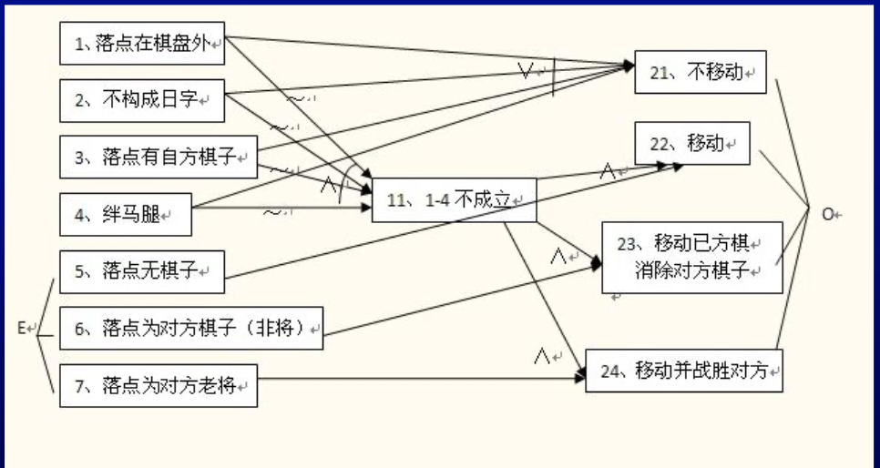

【 2月17日周一】

Software test：verification + validation

* `verification` 验证，检验软件是否已经正确的实现了需求

  **内部过程**

* `validation` 确认

  **外部用户**


测试发展的阶段：

Level 0 : There’s no difference between testing and  debugging 

Level 1 : The purpose of testing is to show correctness 

Level 2 : The purpose of testing is to show that the  software doesn’t work 

Level 3 : The purpose of testing is not to prove anything  specific, but to reduce the risk of using the software 

Level 4 : Testing is a mental discipline that helps all IT professionals develop higher quality software


【2月19日周三】

**Software Faults, Errors & Failures **`key`

* Software `Fault` : A static **defect** in the software 内部静态缺陷，代码出错，根本原因

* Software` Error` : An incorrect **internal state** that is the manifestation of some fault 内部的
* Software `Failure` : External, incorrect behavior with respect to the requirements or other description of the expected behavior 外部的结果

> 程序代码上的错误是fault，fault导致程序内部的状态为error，而程序外部呈现出的为failure
>
> 软件里的 fault 等价于硬件上的设计错误

 ```java
public static int numZero (int [ ] arr)
{ 
    // Effects: If arr is null throw NullPointerException
    // else return the number of occurrences of 0 in arr
    int count = 0;
    for (int i = 1; i < arr.length; i++)
    {
        if (arr [ i ] == 0){
            count++;
        }
    }
    return count;
}

Fault: Should start searching at 0, not 1
    
Test 1
[ 2, 7, 0 ]
Expected: 1
Actual: 1
Error: i is 1, not 0, on the first iteration
Failure: none

Test 2
[ 0, 2, 7 ]
Expected: 1
Actual: 0
Error: i is 1, not 0
Error propagates to the variable count
Failure: count is 0 at the return statement
 ```


**RIPR** Model:

* `Reachability` : The location or locations in the program that  contain the fault must be reached 测试用例能够执行到包含错误的语句
* `Infection` : The state of the program must be incorrect 内部状态有不对的地方，比如i=1而不是0
* `Propagation` : The infected state must cause some output or final **state** of the program to be incorrect 程序的输出和状态不对
* `Revealability `: The tester must observe part of the incorrect portion of the final program state  不正确的部分是否能被观察到

上述例子中Test1满足RI、Test2满足RIPR


**suspiciousness**

failed(s)/totalfailed经过这个语句failed的测试用例数/整个错误的测试用例


> · 指这个测试用例是否经过这个语句


传统测试等级：单元测试 -> 模块测试 -> 集成测试 -> 系统测试 -> 验收测试

* 集成测试：针对内部的模块和模块之间，往往是团队内部人员
* 系统测试：第三方人员对软件质量功能的综合测试

面向对象测试等级：方法内的测试 ->  方法间的测试 -> 类内的测试 -> 类间的测试


**Test Requirements and Criteria**

Test Criterion : A collection of rules and a process that  define test requirements 

* Cover every statement 覆盖每一个语句
* Cover every functional requirement 

Test Requirements : Specific things that must be satisfied  or covered during testing 

* Each statement is a test requirement 
* Each functional requirement is a test requirement


测试活动的四种类型：

* Test Design（基于criteria & 基于 human）
* Test Automation 
* Test Execution
* Test Evaluation

> 其他活动：测试管理、测试保存、测试文档


测试设计：

第一步：抽象出模型


【2月24日周一】

测试自动化：如果软件可观察性和可控性好，则其更容易进行测试自动化

可测性：是否容易发现错误

**测试用例的组成**（key）： 

* 测试输入值 Test case values 影响 `infection`
* 期待结果 Expected results 揭示故障 `revealability`
* 前缀值 Prefix values 可达 `reacheability`
* 后缀值（分为验证值 & 退出值）传播 `propagation`


【2月26日周三】

Junit（4.12）+ hamcrest:

src下的包名和test下的包名一样：保证测试代码的整洁

assertEquals 断言是否相等

注解 ( annotations )：@Before -> @Test -> @After

```java
//---Suite---//
@Runwith(Suite.class)
@SuiteClasses({TestA.class,TestB.class})
public class TestSuite{
    
}

//---Parameterized---//
@Runwith(Parameterized.class)  // 第一步：Annotation
public class TestPara{
    // 第三步
    private int input1;
    private int input2;
    private int expected;
    private Calculate cal = null;
    
    public TestPara(int input1,int input2,int expected){
        // 第四步：构造器，为参数赋初值
        this.input1 = input1;
        this.input2 = input2;
        this.expected = expected;
    }
    
    @Before
    publice void setUp(){
        caln= new Calculate();
    }
    
    @Parameters
    public static Collection<Object[]> getData(){
        // 第二步，注解为Parameters
        // 该方法的名字随便取，重点是返回值得是Collection<>
        return Arrays.asList(new Object[][]{
            {1,1,2},
            {2,3,5}
        });
    }
    @Test
    public void testAdd(){
        // 第五步：测试内容，断言
        assertEquals(this.expected,cal.add(input1,input2));
    }
}
```

软件测试覆盖准则

>覆盖率（coverage level）
>
>指导测试用例的生成
>
>覆盖准则之间有存在蕴含（subsumption）关系，比如口味蕴含颜色


【3月4日周三】

图覆盖

> 必须要有初始节点和终止节点，测试路径必须从**初始**节点出发到**终止**节点结束
>
> 测试路径和测试用例是一对多


dead code：无用无效代码

```java
boolean a = true;
boolean b = true;
if (a & b) {
   System.out.println("execute ok");
} else {
   System.out.println("execute fail");
}// else 部分为 dead code，并且没有测试用例
```

visit & tour （ 访问 &  游历）

* Visit：单个，e.g visits noden, visits edge(n1, n2)
* Tour：多个，e.g tours subpaths [0,1,2], [1,3,4]

语法 & 语义（语义在语法之上）

* Syntactic reach：语法，在图中有子路径
* Semantic reach：语义，测试中可以执行该子路径

NC & EC & EPC

（可达结点覆盖 & 可达边覆盖 & Edge-Pair Coverage 边对覆盖）

* EC: length up to 1, 蕴含了NC

* EPC: length up to 2

> CPC: complete，contains all paths，有循环则 impossible
>
> SPC: Specified
>
> PCP：包含所有主路径

简单路径 & 主路径

* Simple path：没有结点出现两次，除了初始和终点为同一个的情况
* prime path：最大简单路径（注意**环**）

> 找主路径的方法：
>
> 从lenth0开始每次length1扩展，！表示终止，* 表示成环，所有有！和 * 都不能再扩展


【3月9日周一】

Chapter4：图覆盖 Graph Coverage

数据流准则：定义def & 使用use

* ADC 使用每一个定义
* AUC 达到每一个使用
* ADUPC 覆盖所有du-paths（简单路径）

> 定义def & 使用use
>
> 定义：
>
> x is an actual parameter in a call and the method changes its value
>
> x is a formal parameter in a call
>
> 使用：x is an actual parameter to a method

控制流 Control Flow Graphs


Chapter5：逻辑覆盖 Logic Coverage

谓词：a predicate is an expression that evaluates to a boolean value

条件覆盖 & 判定覆盖 & 条件判定覆盖组合，重点是modified condition/decision coverage(MC/DC)

* Decision：Branching expression of the **if/while/for** statements

  又称branch coverage，即覆盖每个分支

* Condition：A Boolean expression **containing no Boolean operators**.If the same expression appears more than once in a decision, each occurrence is considered a **distinct** condition. 

Condition cover 和 Decision cover 互不蕴含

* Multiple Condition Coverage：Cover all possible **combinations** of conditions
* MC/DC：MCC的改进。每个子句的取值能独立的影响结果。

| C1    | C2    | C     |      |
| ----- | ----- | ----- | ---- |
| true  | true  | true  | t1   |
| true  | false | false | t2   |
| false | true  | false | t3   |

> C1 and C2，t1 and t2 cover C2，t1 and t3 cover C1


【3月11日周三】

图覆盖和逻辑覆盖都是基于代码的，白盒测试

Chapter6: Blackbox Testing

single & combination

* Single

Equivalent Class Partitioning (ECP)  等价类划分

> 等价类：引起程序相似的反应，要既考虑合法输入也要考虑非法输入（无效等价类）
>
> 特殊值：empty、null、very long、special value

Boundary Value Analysis：extension of ECP

* Multiple input parameter

判定表（decision table）


> 此表可合并


【3月16日周一】

Cause-Effect Graph （CEG 因果图法）

条件和条件之间的关系，结果和结果之间的关系要标清楚：**Identical、与And、或Or、非Not**

* E（互斥）a and b can not be 1 at the same time 
* I（包含）One of a、b and c must be 1 at leastThey can’t be 0 at the same time
* O（唯一）Only one of a and b is 1 and must one of them is 1 
* M（强制）If the result of a is 1 then b must be 0 
* R（要求）If a is 1 then b must be 1



两两组合（pairwise）


【3月18日周三】

Chapter7: Test Automation and Selenium

Steps of creating a test case by Selenium IDE: 

* Record
* Base URL
* A sequence of actions

Find web elements by **webdriver**：

`ID` `Name` `Xpath` `Class Name` `Link Test`


Chapter8: Test Driven Development, Integration, Testing, Stub and Mock

MVC: Model Service Dao Util

> 删除测试的时候，应当先add再delete，保证测试执行前后**无损**的


【3月25日 周三】

集成测试：将两个和多个模块合并在一起

Stub：被调用 —— **自顶向下集成** （A调用B，要测试A，但是B没写好）

Driver：调用 —— **自底向上集成**（A调用B，要测试B，但是A没写好）

**三明治集成**（stub & driver）

单元测试 & 集成测试

* 访问了数据
* 有网络通讯
* 访问了文件系统
* 不与其他任何单元测试同时进行
* 必须配置好环境后才能运行

> 原因：会使单元测试速度降低
>
> 上述情况更应归为集成测试

Stub（状态） & Mock（交互）

> 比如在Stub中load了两次，但是因为只关心返回值，所以测试并不会报错，所以需要用Mock来透露交互信息

Mock：

- Record 创建Mock对象并给出Mock对象的一系列期望
- Replay 测试重放
- Verify 验证交互是否满足要求


【x月xx日 周三】

Chapter9: Performance Testing and Jmeter

Performance Testing 性能测试

Load Testing 负载测试

Stress Testing 压力测试（峰值）

